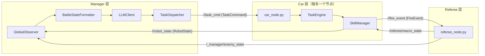
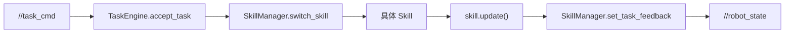

# TECHNICAL (ROS 对抗控制链路)

本文档描述 `robot_vs` 的 **ROS 主链路技术实现**，聚焦三层：

- Manager 层（战术决策与任务分发）
- Car 层（车辆执行层，非 MAS Agent 概念）
- Referee 层（全局裁判）

---

## 1. 总览架构



---

## 2. Manager 层（`scripts/manager/`）

Manager 的单次循环：

1. `GlobalObserver.get_battle_state()` 聚合己方车辆与敌情状态  
2. `BattleStateFormatter.build()` 构造规划输入  
3. `LLMClient.plan_tasks()` 请求 LLM 服务（失败时规则兜底）  
4. `TaskDispatcher.dispatch()` 发布 `TaskCommand`

核心组件：

- `manager_node.py`：节点入口与主循环
- `global_observer.py`：状态订阅与失联超时判定
- `battle_state_formatter.py`：状态格式化
- `llm_client.py`：LLM 调用与规则回退
- `task_dispatcher.py`：任务发布、任务签名去重、`task_id` 管理

---

## 3. Car 层（`scripts/car/`）

> 这里是“车辆执行层”，不与 MAS 的 `CarAgent` 概念混用。

单车执行链路：



### 3.1 关键角色

- `car_node.py`：ROS 节点入口，固定频率驱动 `task_engine.tick()`
- `task_engine.py`：任务快照、超时处理、技能状态流转
- `skill_manager.py`：ROS 发布订阅、技能工厂、状态发布

### 3.2 Skill 集合

位于 `scripts/car/skills/`：

- `GoToSkill`：导航目标点
- `StopSkill`：刹停
- `AttackSkill`：面向目标并开火事件
- `RotateSkill`：原地旋转到目标角 `target_yaw`

### 3.3 任务动作与参数

动作集合：

- `STOP`
- `GOTO`
- `ATTACK`
- `ROTATE`

`ROTATE` 依赖 `TaskCommand.target_yaw`，由 `RotateSkill` 读取并执行角度闭环。

---

## 4. Referee 层（`scripts/manager/referee_node.py`）

Referee 为全局唯一裁判，负责：

1. 动态发现并订阅各车 `/robot_state` 与 `/fire_event`
2. 维护全局状态（位置、朝向、阵营、血量、弹药、生死）
3. 命中判定与扣血（射程/宽度/视线等规则）
4. 发布双方可见敌人和宏观战场状态

关键输出话题：

- `/red_manager/enemy_state`
- `/blue_manager/enemy_state`
- `/referee/macro_state`

---

## 5. ROS 消息接口

### 5.1 `TaskCommand.msg`（Manager → Car）

```text
uint32 task_id
string action_type          # GOTO / STOP / ATTACK / ROTATE
string reason
float32 target_x
float32 target_y
float32 target_yaw          # 新增：ROTATE 或朝向目标
uint8 mode
float32 timeout
```

### 5.2 `RobotState.msg`（Car → Manager/Referee）

用于上报车辆自身状态、动作状态和任务执行反馈。

### 5.3 `FireEvent.msg`（Car → Referee）

用于裁判层命中判定与弹药结算。

---

## 6. 命名空间与隔离

每车独立命名空间（如 `robot_red_1`、`robot_blue_1`），典型话题：

- `/<ns>/task_cmd`
- `/<ns>/robot_state`
- `/<ns>/move_base_simple/goal`
- `/<ns>/cmd_vel`
- `/<ns>/fire_event`

配合 TF 前缀隔离，避免多车话题与坐标冲突。

---

## 7. 一致性与扩展方向

- 仿真与实机尽量保持同构话题设计
- Manager 层可无缝切换规则规划与 LLM 规划
- Car 层技能可按动作类型继续扩展（如更复杂的瞄准/规避技能）
