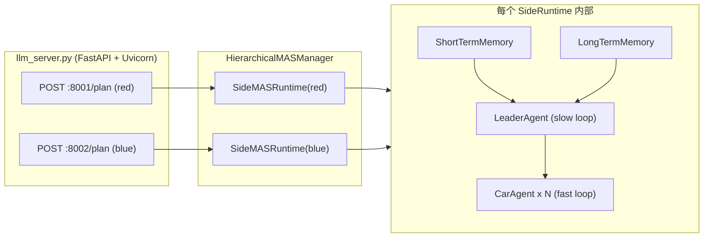
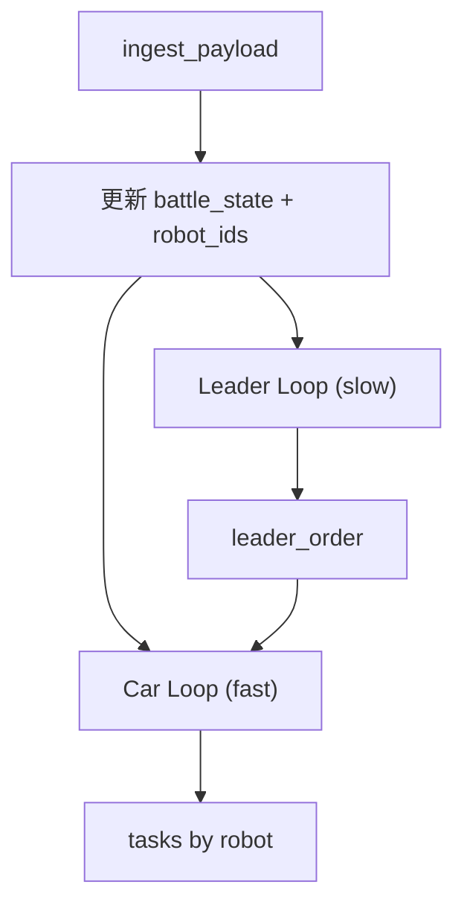

# TECHNICAL_MAS (多智能体 + 大模型链路)

本文档描述 `robot_vs/scripts/MAS/` 的多智能体技术方案：

- LeaderAgent（慢速战略层）
- CarAgent（快速战术层）
- 记忆系统（STM/LTM）
- 双端口 LLM 服务（红蓝并行）

---

## 1. 总体架构



---

## 2. 分层职责

## 2.1 LeaderAgent（`agents/leader_agent.py`）

- 低频（默认约 5s）战略推理
- 基于 `global_state + STM摘要 + LTM摘要` 生成 `leader_order`
- 带最小周期缓存，避免重复推理
- LLM 失败时使用策略回退文本
- 结果写入 LTM（`leader_order` 记录）

## 2.2 CarAgent（`agents/car_agent.py`）

- 高频（默认约 1s）单车战术决策
- 并发为每台车发起独立 LLM 请求
- 输出规范化任务：`STOP/GOTO/ATTACK/ROTATE`
- 支持动作别名归一化（如 `TURN -> ROTATE`, `MOVE -> GOTO`）
- 请求失败时优先复用最近任务，否则快速规则回退

---

## 3. 记忆系统

## 3.1 STM（`memory/stm.py`）

- 滑动窗口短期记忆（最近状态快照）
- 用于 Leader 提示词中的近期态势总结（血量变化、可见敌人数、弹药等）

## 3.2 LTM（`memory/ltm.py`）

- JSONL 持久化长期记忆
- 记录战略经验、教训与摘要
- 支持按标签/类型筛选摘要并注入 Leader 提示词

---

## 4. SideMASRuntime 双速率循环

`mas_manager.py` 中每个阵营 runtime 同时运行两条异步循环：



- Slow loop：刷新战略命令（`leader_order`）
- Fast loop：基于战略命令和局部状态并发生成各车任务
- `handle_plan_request()` 会在任务过期时强制补跑 fast loop，保证输出新鲜度

---

## 5. 服务接口与数据契约

`llm_server.py` 暴露：

- `GET /health`
- `POST /plan`

输入（简化）：

```json
{
  "battle_state": {...},
  "robot_ids": ["robot_red_1", "robot_red_2"]
}
```

输出（简化）：

```json
{
  "tasks": {
    "robot_red_1": {
      "action": "ROTATE",
      "target": {"x": 0.0, "y": 0.0, "yaw": 1.57},
      "mode": 1,
      "reason": "scan corner",
      "timeout": 2.0
    }
  },
  "leader_order": "...",
  "side": "red",
  "meta": {"leader_age_s": 0.5, "task_age_s": 0.2}
}
```

---

## 6. 与 ROS 主链路的衔接关系

- MAS 输出的 `tasks` 被 Manager 层接收并转换为 `TaskCommand`
- `target.yaw` 对应 `TaskCommand.target_yaw`
- Car 层接到 `action=ROTATE` 时由 `RotateSkill` 执行

---

## 7. 当前设计优势

- 战略与战术分频，降低整体阻塞风险
- 每车并发请求，提升多车扩展能力
- 记忆系统可持续积累经验，提升稳定性
- 具备多层回退（缓存/复用/规则）保障可用性
